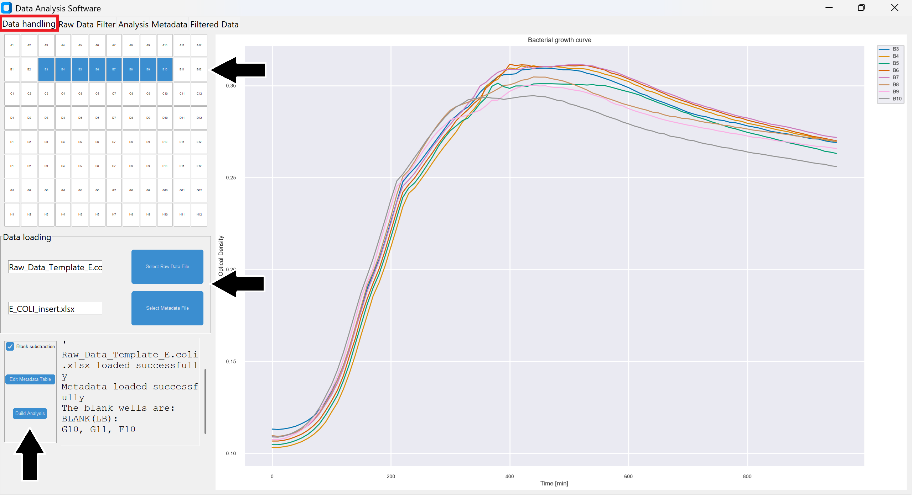
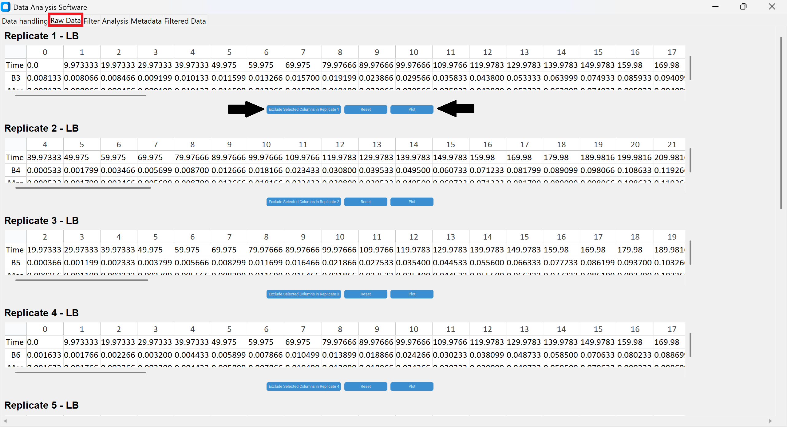
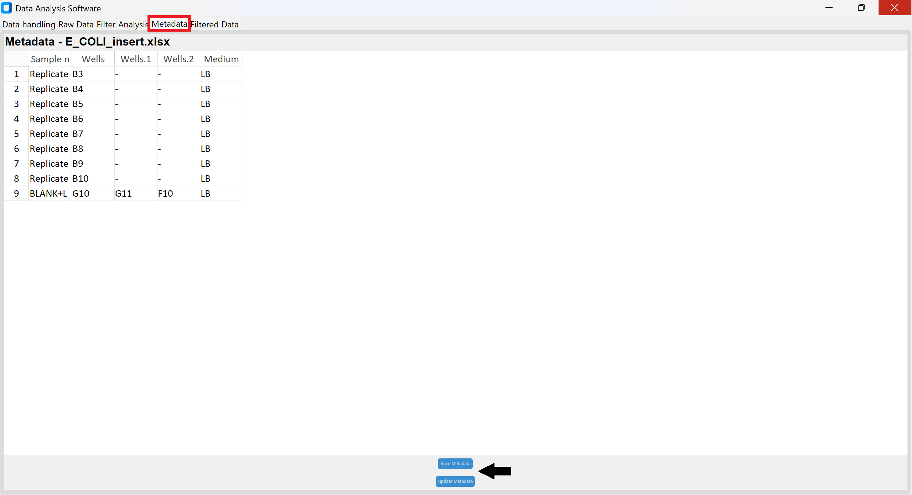
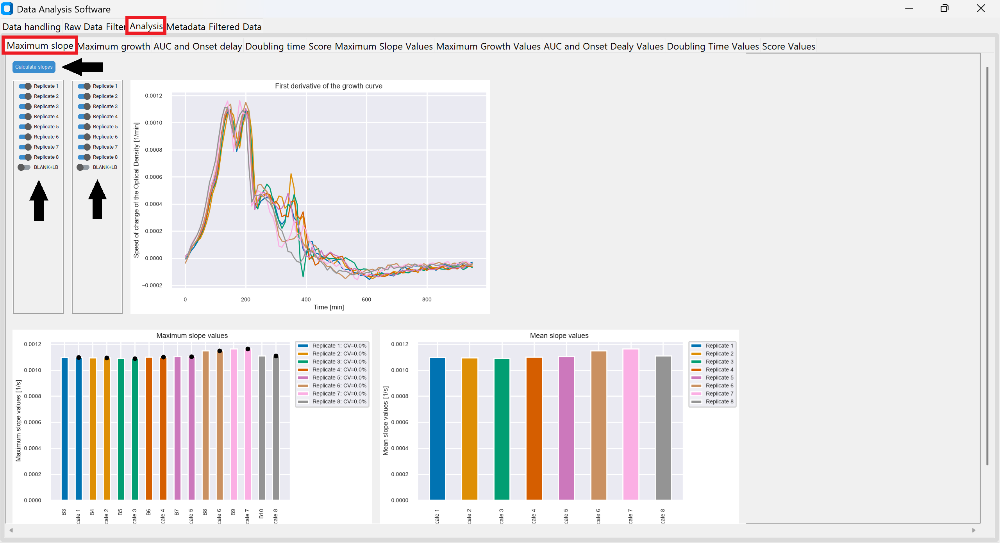
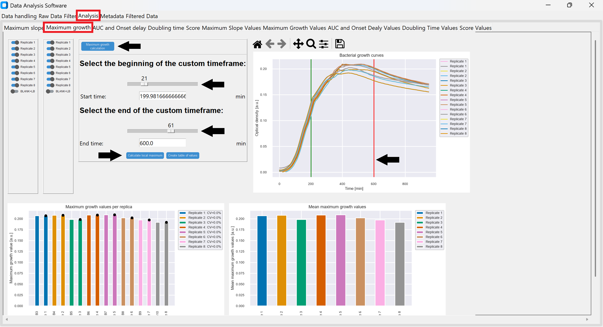
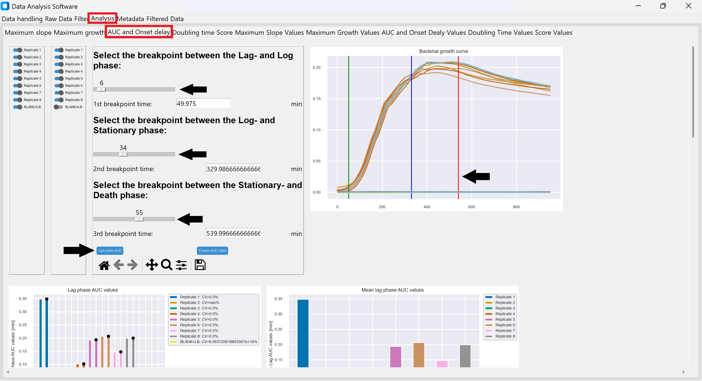
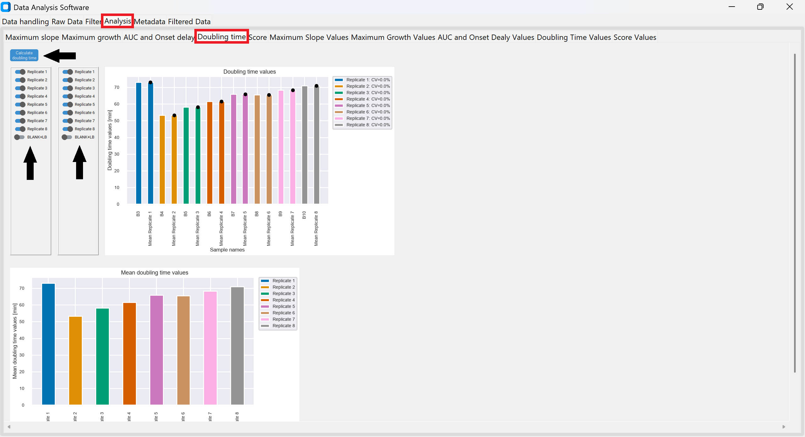
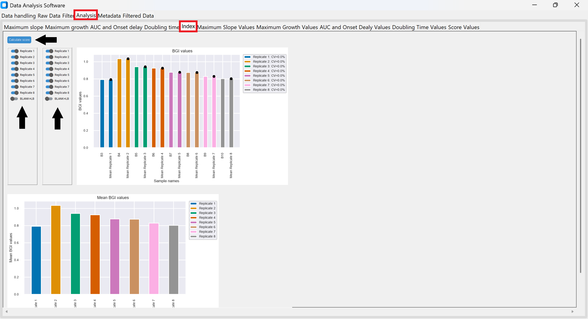
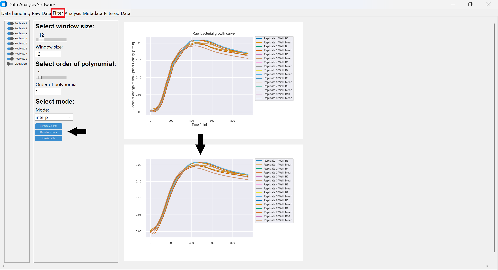
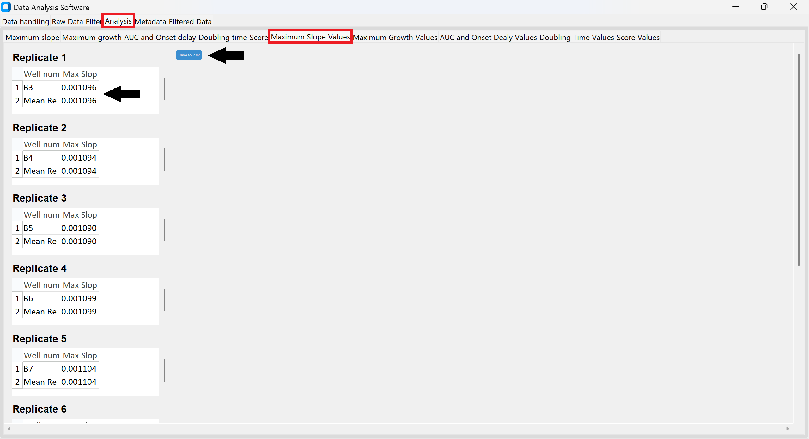

# README - BactoIndex

## 1. Bacto Index

BactoIndex is a standalone software tool for standardized, model-free analysis of bacterial growth curves from optical density (OD) measurements. It provides an interactive graphical user interface for data visualization, preprocessing, growth-parameter calculation, and export of results and figures. In addition to conventional growth parameters, BactoIndex calculates the Bacterial Growth Index (BGI), which integrates complementary aspects of bacterial growth dynamics into a single quantitative measure.

## 2. Key features

- Analysis and visualization of bacterial growth curves from up to 96-well plates  
- Metadata-based assignment of samples, replicates, media, and blanks  
- Automatic blank subtraction  
- Optional data filtering and exclusion of individual time points  
- Calculation of maximum growth and maximum slope  
- Phase-specific area under the curve (AUC) analysis  
- Calculation of onset delay and doubling time  
- Calculation of the Bacterial Growth Index (BGI)  
- User-defined growth-phase boundaries  
- Export of calculated parameters as CSV files  
- Export of graphs as PNG, PDF, and SVG files 

## 3. Installation

Detailed installation instructions are provided separately for Windows and macOS: 

- [README_Windows](README_Windows.md)
- [README_Mac](README_Mac.md)

The required Python dependencies are listed in [requirements.txt](requirements.txt)

## 4. Input files

BactoIndex requires two input files: a **raw data file** containing the optical density (OD) measurements and a **metadata file** describing the experimental plate layout. Templates for both files are provided with BactoIndex.

### 4.1 Raw data

The raw OD measurements should be entered into the provided [Raw_Data_Template.xlsx](Raw_Data_Template.xlsx) file. Data should be copied directly from the plate-reader output into the template without prior preprocessing. 

The template contains the measurement time, cycle number, and OD values for the individual wells of the 96-well plate. Unused measurement cycles should be removed, whereas unused wells may remain in the file with values of 0. 

BactoIndex automatically converts the imported time values to minutes for downstream analysis. If blank substraction is enabled, blank subtraction is performed within BactoIndex; therefore, OD values do **not need to be blank-corrected before import.**

Detailed instructions for preparing the raw data file are provided in the README sheet of the [Raw_Data_Template.xlsx](Raw_Data_Template.xlsx) file.

### 4.2 Metadata

The corresponding plate layout and sample information should be entered into the provided [Meta_File_Template.xlsx](Meta_File_Template.xlsx) file. 

Each sample is defined by its sample name, the corresponding well(s), and the medium used. Technical replicates belonging to the same sample should be entered in the same row using separate Wells columns. BactoIndex treats wells listed within the same row as replicates and averages them during analysis. If samples contain different numbers of replicate wells, unused Wells cells must be filled with a dash (-) and should not be left empty. 

Blank wells should also be specified in the metadata file together with the corresponding medium. This allows BactoIndex to assign the appropriate blank measurement to each sample during background subtraction.

Column names provided in the template should **not be changed**. If additional replicate wells are required, additional columns can be added using the exact header Wells. Every Wells column must contain either a valid well identifier or a dash (-).

Detailed instructions and an example are provided in the README sheet of the [Meta_File_Template.xlsx](Meta_File_Template.xlsx) file. 

## 5. Quick start/ workflow

After installation, launch BactoIndex and follow the workflow below: 

1. **Load the input files**
In the **Data Handling** section, upload the completed raw data and metadata files. After loading, the 96-well plate layout is displayed and individual wells can be selected to inspect their growth curves. 

2. **Inspect and, if necessary, edit the data**
Use the **Raw Data** section to inspect the imported measurements and exclude individual time points if required. The **Metadata** section can be used to verify or modify the imported sample information. 

3. **Apply optional filtering**
The **Filter** section provides optional smoothing of growth curves to reduce experimental noise.

4. **Define analysis settings**
Navigate to the **Analysis section** to select samples and define the required analysis settings. User-defined time windows can be specified for maximum-growth calculations, and growth-phase boundaries can be defined for phase-specific AUC calculations.

5. **Calculate growth parameters**
BactoIndex can calculate maximum slope, maximum growth, phase-specific AUC, onset delay, doubling time, and BGI. Detailed instructions for each parameter are provided in the Growth parameters section below.

6. **Export the results**
Calculated parameters can be exported as CSV files. Generated graphs can be exported as PNG, PDF, or SVG files.

## 6. Growth parameters
BactoIndex provides several conventional growth parameters that can be calculated individually from the **Analysis** section. Samples to be included in the analysis can be selected or deselected using the corresponding sample controls. Calculated values can subsequently be displayed in tables and exported as CSV files.

### 6.1 Maximum slope
The maximum slope represents the steepest increase in OD over time and is determined from the maximum first derivative of the growth curve.

To calculate the maximum slope:
1. Click **Calculate Maximum Slope**
2. Select the samples to be displayed.
3. Inspect the resulting growth curves and calculated values.

The maximum slope is reported in **OD/min**

### 6.2 Maximum growth

Maximum growth represents the highest OD value reached by a sample within the analyzed time period. 

BactoIndex provides two options for determining maximum growth:

- **Global maximum:** Click **Calculate Maximum Growth** to automatically identify the highest OD value across the complete growth curve.
- **Local maximum:** Define a time window using the breakpoints and click **Calculate Local Maximum** to determine the highest OD value within the selected interval.

The local maximum option can be useful when only a specific part of the growth curve should be considered, for example when late measurements are affected by experimental artifacts.

After calculation, click **Create table of values** to generate the results table for subsequent CSV export.

### 6.3 Phase-specific AUC

BactoIndex calculates separate area under the curve (AUC) values for different phases of bacterial growth. The growth phases are defined by three user-defined breakpoints:

- lag → exponential phase
- exponential → stationary phase
- stationary → death phase

Because different samples may exhibit different growth kinetics, we recommend defining the breakpoints **individually for each sample or for groups of samples with similar growth profiles**, rather than applying identical breakpoints to all samples.

To calculate phase-specific AUC values:

1. Display the sample or group of samples to be analyzed.
2. Set the three breakpoints according to the displayed growth curve.
3. Click **Calculate AUC**.
4. Deselect the analyzed sample(s) and display the next sample or group of samples.
5. Adjust the breakpoints according to the new growth curve and click **Calculate AUC** again.
6. Repeat this procedure until all samples have been analyzed.

BactoIndex retains the individually calculated AUC values while proceeding between samples. It is therefore important to ensure that **only the samples for which the currently displayed breakpoints are appropriate are selected when Calculate AUC is pressed**.

Four phase-specific AUC values are generated, corresponding to the lag, exponential, stationary, and death phases. If required, **total AUC** can subsequently be calculated as the sum of these four phase-specific AUC values.

Once all samples have been analyzed, display the desired samples and click **Create AUC table** to generate the results table for CSV export.

**Important:** Breakpoints must also be assigned to blank samples. The exact position of the breakpoints for blanks is not biologically relevant, but breakpoints are required for the subsequent calculation of doubling time.

### 6.4 Onset delay

The onset delay is determined together with the phase-specific AUC analysis and describes the time preceding the onset of exponential growth. 

Because its calculation depends on the user-defined transition between the lag and exponential phases, appropriate breakpoint placement is important for obtaining meaningful onset-delay values.

### 6.5 Doubling time

Doubling time describes the estimated time required for the bacterial population to double during its period of fastest exponential growth. 

Before calculating doubling time, ensure that the required growth-phase breakpoints have been assigned to all samples, **including blanks**.

To calculate doubling time:
1. Click **Calculate Doubling Time**.
2. Select the samples to be displayed.
3. Inspect the calculated values and corresponding plots.

Doubling time is reported in **minutes**.

### 6.6 Bacterial Growth Index (BGI)

The Bacterial Growth Index (BGI) is a composite measure designed to integrate complementary aspects of bacterial growth behavior into a single quantitative value. In contrast to individual growth parameters, which describe specific features of a growth curve, the BGI incorporates information related to adaptation, growth kinetics, and biomass accumulation.

The BGI combines the kinetic efficiency of bacterial growth with the integrated growth during the exponential and stationary phases:

$$
BGI = \underbrace{EDR}_{kinetics}\cdot \underbrace{(AUC_{log}+AUC_{stationary})}_{growth\space extent}
$$

The kinetic component of the BGI is represented by the Effective Doubling Ratio (EDR), which combines onset delay and exponential growth kinetics. The EDR is calculated automatically by BactoIndex as part of the BGI calculation and is not reported as a separate output. For the complete mathematical definition and derivation of the BGI, please refer to the associated BactoIndex publication.

A higher BGI generally reflects a combination of efficient adaptation, rapid growth, and greater biomass accumulation under the analyzed experimental conditions. Conversely, a lower BGI may result from prolonged adaptation, slower growth, reduced biomass accumulation, or a combination of these features.

The BGI is **dimensionless when OD is treated as a dimensionless quantity** and should be interpreted as an integrated descriptor of bacterial growth performance under the tested conditions. It is intended to complement, rather than replace, inspection of the individual growth parameters and the underlying growth curve. 

To calculate the BGI:

1. Complete the required phase-specific analyses and ensure that the appropriate growth-phase breakpoints have been assigned.
2. Click **Calculate Index**.
3. Select the samples to be displayed.
4. Inspect the calculated BGI values and corresponding plots. 
5. Generate the results table for subsequent CSV export.

## 7. Data preprocessing

BactoIndex provides several preprocessing options to prepare raw OD measurements for downstream growth-curve analysis. To ensure reproducibility, we recommend importing raw plate-reader measurements without prior blank subtraction, smoothing, or other external preprocessing whenever possible. 

### 7.1 Blank subtraction

Blank substraction can be enabled or disabled within BactoIndex. When enabled, BactoIndex identifies the blank wells according to the information provided in the metadata file and calculates the mean OD trajectory of the corresponding blank wells. 

This mean blank trajectory is subtracted from the OD measurements of samples grown in the corresponding medium. Therefore, it is important that blank wells are correctly assigned to their respective media in the metadata file.

Raw OD measurements should **not be manually blank-corrected before import** when blank subtraction is performed within BactoIndex.

### 7.2 Handling of negative OD values

Background subtraction may result in negative OD values, particularly during early time points when sample OD values are close to the background signal. 

BactoIndex automatically excludes negative OD values generated after blank subtraction from downstream growth-parameter calculations. The corresponding measurement time points remain unchanged, and the original time axis is not reset. No manual removal of negative OD values is required.

### 7.3 Exclusion of individual time points

Individual measurements can be excluded if they are affected by obvious experimental or technical artifacts.

To exclude time points, navigate to the **Raw Data** section and select the corresponding columns/time points for the sample of interest. Apply the exclusion using **Exclude selected columns in [sample]** and click **Plot** to update the displayed growth curve.

Excluded measurements are subsequently omitted from the analysis.

**Recommendation:** Data points should only be excluded when there is a clear experimental or technical justification. Exclusion criteria should be applied consistently across the dataset. 

### 7.4 Filtering and smoothing

BactoIndex provides an optional filtering function to reduce experimental noise in OD measurements and improve visualization of growth trajectories. 

Filtering can be applied in the **Filter** section before calculating downstream growth parameters. 

Because smoothing can influence the shape of the growth curve and consequently derived parameters, the same filtering settings should be applied consistently when samples are intended to be directly compared.

### 7.5 User-defined analysis boundaries

Some BactoIndex calculations require user-defined time windows or growth-phase boundaries. 

For phase-specific AUC analysis, three breakpoints define the transitions between:

- lag and log growth,
- log and stationary growth, and
- stationary and death phases.

Because growth kinetics may differ substantially between samples, breakpoints can be assigned individually to each sample or to groups of samples with similar growth profiles. Detailed instructions for breakpoint assignment are provided in Section 6.3. 

For local maximum growth calculations, users can additionally define the time interval within which the maximum OD should be determined. 

When comparing samples or experimental groups, analysis boundaries should be selected according to consistent biological criteria. 

## 8. Output/export

BactoIndex allows calculated growth parameters and generated graphs to be exported for downstream statistical analysis, visualization, or preparation of publication figures.

### 8.1 Export of calculated values
Calculated growth parameters are displayed in dedicated results tables within BactoIndex.

To export a results table:
1. Navigate to the corresponding results tab, for example **Maximum Slope Values, Maximum Growth Values, AUC Values, Doubling Time Values,** or **Index Values**.
2. Review the calculated values displayed in the table.
3. Click **Save to .csv**.
4. Select the desired location and filename.

The resulting CSV files can subsequently be opened in spreadsheet or statistical software for further analysis. 

**Note:** BactoIndex exports the calculated values without performing statistical comparisons between experimental groups. Statistical analyses should be performed separately using an appropriate statistical approach for the experimental design.

### 8.2 Export of graphs

Graphs generated within BactoIndex can be customized and exported directly from the software. 

Right-click on a graph to access the available customization and export options. Depending on the graph, users can:
- change the graph title;
- modify the x- and y-axis labels; and
- export the graph in PNG, PDF, or SVG format.

For subsequent editing or preparation of publication figures, **SVG is recommended** because it is a vector format and can be resized without loss of resolution. PNG can be used when a raster image is required, while PDF provides an additional format suitable for sharing and publication workflows.

### 8.3 Recommended data handling

We recommend retaining the exported CSV files together with the corresponding raw data, metadata, and analysis settings. This facilitates traceability of the analysis and allows calculated results to be linked back to the original experimental data. 

When figures are further modified using external software, the original BactoIndex export should also be retained. 

## 9. Example data
An example antibiotic growth-inhibition dataset is provided with BactoIndex to allow users to familiarize themselves with the software and test the complete analysis workflow. TThe dataset contains Escherichia coli K12 growth curves measured under different concentrations of chloramphenicol and corresponds to the antibiotic growth-inhibition experiment used for validation of BactoIndex in the associated manuscript.  

The example dataset includes the raw OD measurements and the corresponding metadata file required for import into BactoIndex.  

It can be used to practice:
- importing raw OD measurements and metadata;
- visualizing individual wells and growth curves;  
- performing blank subtraction and data preprocessing;
- defining growth-phase boundaries;
- calculating maximum slope and maximum growth;
- calculating phase-specific AUC and onset delay;
- calculating doubling time and BGI; and
- exporting calculated values and graphs.  

The example files can be accessed here:
- [Meta_File_Example](Meta_File_Example.xlsx)
- [Raw_Data_Example](Raw_Data_Example.xlsx)

Detailed information on the required structure of the input files is provided in the README sheets included in the [Raw_Data_Template.xlsx](Raw_Data_Template.xlsx) and [Meta_File_Template.xlsx](Meta_File_Template.xlsx) files.

## 10. Citation

If you use BactoIndex in your research, please cite the BactoIndex manuscript: 

Varga M*, Scalise MC*, Frei M*. *BactoIndex: A model-free framework for quantitative bacterial growth analysis* [Journal, year, volume, pages, DOI – to be added upon publication] 

*These authors contributed equally to this work.

If BactoIndex is used to generate results presented in a publication, please also specify the **software version** used to facilitate reproducibility.

## 11. License 

BactoIndex is distributed under the MIT License. See the [LICENSE.docx](LICENSE.docx) or file for details.

## 12. Authors/contact

BactoIndex was developed through a collaboration between computational software development, scientific development and experimental validation.

**Software development:**
- **Martin Varga:** software design, development, and implementation
- **Mike Frei:**  software design, development

**Scientific development and validation:**
- **Melanie C. Scalise:** scientific validation, biological application, and experimental benchmarking

**Supervision:**
- Maria Luisa Balmer
- Lilian Witthauer
- Dominik Meinel

**Contact and support:**  

For questions regarding BactoIndex, please contact: 

Prof. Maria Luisa Balmer  
Institute for Infectious Diseases  
University of Bern  
maria.balmer@unibe.ch    

Technical problems and bug reports can also be submitted through the repository's Issues page.
